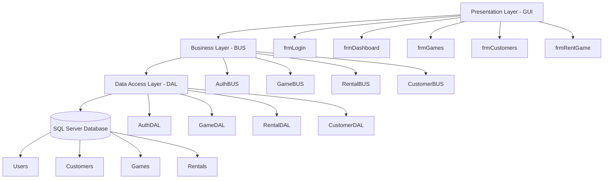
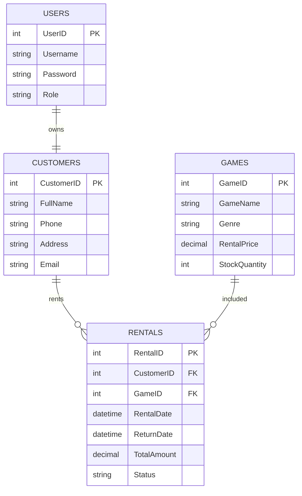

# GAME RENTAL MANAGEMENT SYSTEM

## Giới thiệu

Game Rental Management System là phần mềm quản lý cửa hàng cho thuê game được phát triển bằng C# WinForms kết hợp SQL Server.  
Hệ thống hỗ trợ quản lý game, khách hàng, đơn thuê game và thống kê doanh thu.

Phần mềm được xây dựng theo mô hình 3-Layer Architecture nhằm tối ưu khả năng quản lý source code, dễ bảo trì và mở rộng.

---

# Chức năng chính

## Quản lý tài khoản
- Đăng ký tài khoản
- Đăng nhập hệ thống
- Phân quyền Admin / User
- Lưu Session người dùng hiện tại

## Quản lý game
- Thêm game mới
- Chỉnh sửa thông tin game
- Xóa game
- Tìm kiếm game
- Quản lý số lượng tồn kho

## Thuê game
- Thuê game theo số ngày
- Tính tổng tiền tự động
- Giảm số lượng tồn kho khi thuê
- Lưu lịch sử thuê game

## Refund / Trả game
- Hoàn trả game
- Cập nhật trạng thái đơn thuê
- Tăng lại số lượng tồn kho

## Dashboard thống kê
- Tổng số game
- Tổng khách hàng
- Tổng đơn thuê
- Tổng doanh thu

---

# Công nghệ sử dụng

| Công nghệ | Mô tả |
|---|---|
| C# WinForms | Giao diện desktop |
| SQL Server | Hệ quản trị cơ sở dữ liệu |
| ADO.NET | Kết nối và xử lý dữ liệu |
| Git & GitHub | Quản lý source code |
| Swagger | Test API |
| Visual Studio 2022 | IDE phát triển |

---

# Kiến trúc dự án

Dự án được xây dựng theo mô hình 3-Layer Architecture nhằm tách biệt giao diện, xử lý nghiệp vụ và truy xuất dữ liệu.  
Kiến trúc này giúp hệ thống dễ bảo trì, dễ mở rộng và quản lý source code tốt hơn.

---

## Sơ đồ kiến trúc hệ thống

---

## 1. Presentation Layer (GUI)

Đây là tầng giao diện người dùng, nơi người dùng tương tác trực tiếp với hệ thống.

Bao gồm:
- frmLogin
- frmRegister
- frmDashboard
- frmGames
- frmCustomers
- frmRentGame
- frmRentalManagement

### Chức năng:
- Hiển thị dữ liệu
- Nhận thao tác người dùng
- Gửi dữ liệu xuống BUS
- Hiển thị kết quả xử lý

Ví dụ:
- Người dùng nhấn nút “Rent Game”
- Form gửi GameID xuống RentalBUS
- Sau khi xử lý thành công sẽ hiển thị thông báo

---

## 2. Business Layer (BUS)

Đây là tầng xử lý nghiệp vụ chính của hệ thống.

Bao gồm:
- AuthBUS
- RentalBUS
- GameBUS
- CustomerBUS

### Chức năng:
- Kiểm tra logic dữ liệu
- Xử lý nghiệp vụ hệ thống
- Tính toán tổng tiền
- Kiểm tra tồn kho
- Phân quyền người dùng
- Điều phối dữ liệu giữa GUI và DAL

Ví dụ:
- Kiểm tra game còn hàng hay không
- Tính tổng tiền thuê theo số ngày
- Xử lý refund game

---

## 3. Data Access Layer (DAL)

Đây là tầng làm việc trực tiếp với cơ sở dữ liệu SQL Server.

Bao gồm:
- AuthDAL
- RentalDAL
- GameDAL
- CustomerDAL
- UserDAL

### Chức năng:
- Kết nối SQL Server
- Thực thi câu lệnh SQL
- Truy vấn dữ liệu
- Insert / Update / Delete dữ liệu

Ví dụ:
- INSERT INTO Rentals
- UPDATE Games SET StockQuantity
- SELECT FROM Users

---

## 4. DTO (Data Transfer Object)

DTO dùng để truyền dữ liệu giữa các tầng trong hệ thống.

Bao gồm:
- UserDTO
- GameDTO
- RentalDTO
- CustomerDTO

### Chức năng:
- Lưu trữ dữ liệu object
- Giảm phụ thuộc giữa các tầng
- Dễ bảo trì source code
- Dễ mở rộng hệ thống

# Cơ sở dữ liệu

## Các bảng chính

- Users
- Customers
- Games
- Rentals
- RentalDetails

# Kỹ thuật T-SQL và CSDL trọng tâm

| Kỹ thuật | Mô tả |
|---|---|
| View | Hiển thị danh sách game và lịch sử thuê |
| Stored Procedure | Xử lý thêm / sửa / xóa dữ liệu |
| Function | Tính tổng tiền thuê game |
| Trigger | Tự động cập nhật số lượng tồn kho |
| Transaction | Đảm bảo toàn vẹn dữ liệu khi thuê game |
| Primary Key | Định danh duy nhất cho mỗi bảng |
| Foreign Key | Liên kết dữ liệu giữa các bảng |
| JOIN | Kết nối nhiều bảng dữ liệu |
| Aggregate Function | COUNT(), SUM() thống kê dữ liệu |
| CRUD Operations | Thêm / sửa / xóa / truy vấn dữ liệu |
| Session Login | Lưu thông tin người dùng hiện tại |
| Role Permission | Phân quyền Admin / User |

---

## Database Diagram

---

# Luồng hoạt động hệ thống

## Đăng ký tài khoản

1. Người dùng nhập thông tin
2. Hệ thống tạo User
3. Hệ thống tự động tạo Customer
4. Liên kết User ↔ Customer

---

## Thuê game

1. Người dùng chọn game
2. Chọn thời gian thuê
3. Hệ thống tính tổng tiền
4. Tạo Rental
5. Trừ StockQuantity

---

## Refund game

1. Chọn đơn thuê
2. Cập nhật trạng thái Returned
3. Tăng lại StockQuantity

---

# Kỹ thuật nổi bật

- 3-Layer Architecture
- Session Login
- Role Permission
- CRUD đầy đủ
- SQL Server Integration
- Dynamic Statistics Dashboard
- Real-time Stock Update
- Refund Logic
- Auto Link User ↔ Customer

---

# Phiên bản phần mềm

| Phần mềm | Phiên bản |
|---|---|
| Visual Studio | 2022 |
| SQL Server | 2019 |
| .NET Framework | 4.7.2 |
| Swagger | Latest |

---

# Thành viên thực hiện

- Trần Nguyên Khang

---